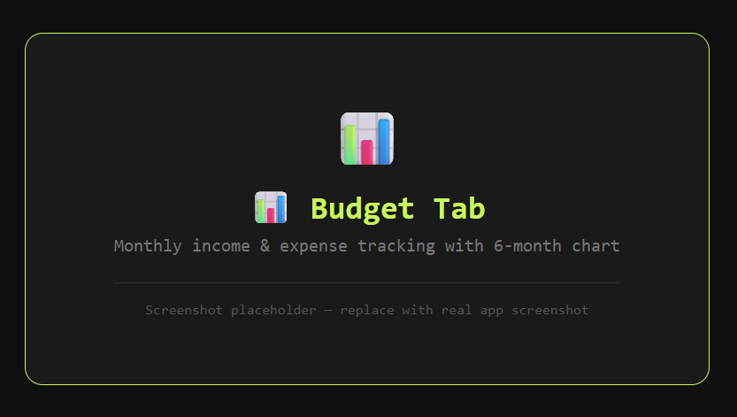
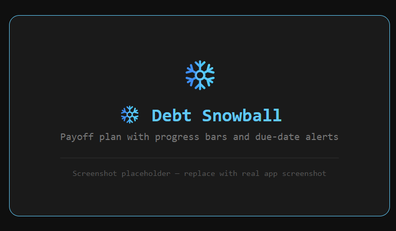
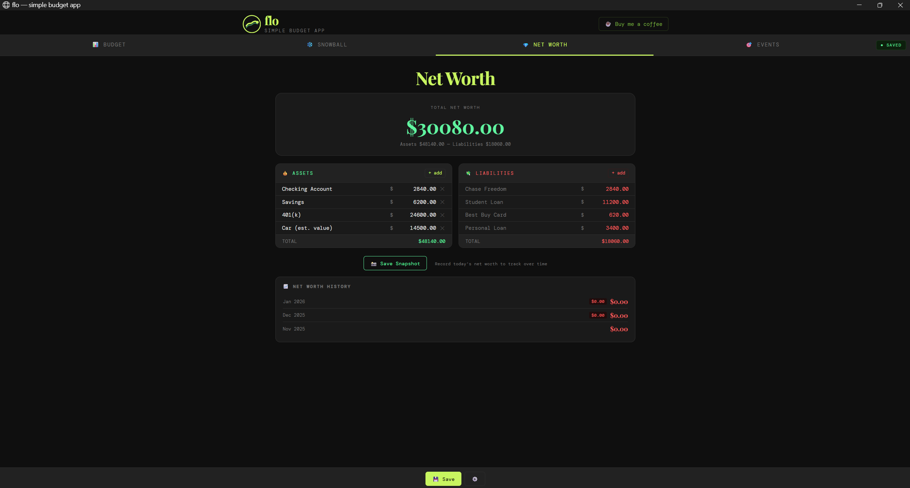
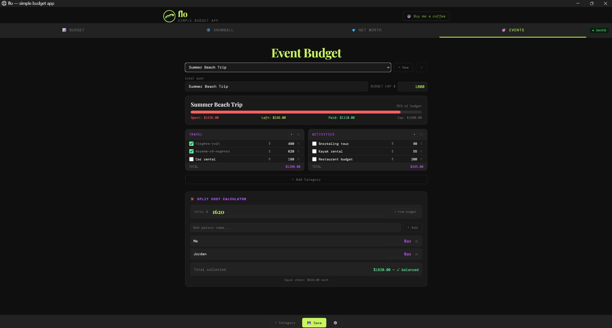

<div align="center">


# flo

**Take control of your money.**

[](LICENSE)
[](#)
[](#getting-started)
[](https://flutter.dev)
[](#changelog)
[](https://www.paypal.com/paypalme/speeddevilx)

*Monthly budgets · Debt snowball · Net worth · Event planning · Split costs*  
*100% offline · 100% open source · No accounts · No cloud · No ads*

**Current version: v1.4.0 — Flutter Edition**

</div>

---

## Screenshots

| Budget | Debt Snowball |
|:---:|:---:|
|  |  |

| Net Worth | Event Budget |
|:---:|:---:|
|  |  |

---

## What is flo?

**flo** is a free, open source personal finance app for people who want real control over their money — without handing it to a subscription service.

No accounts. No cloud. No ads. No paywalls. Your data lives in a plain file on your own machine. You own it completely.

As of v1.4, flo is built with **Flutter** — a single codebase that runs natively on Linux, Windows, Android, and iOS. It's fast, offline-first, and small enough to understand in an afternoon.

Whether you're getting out of debt, tracking your net worth, or planning a wedding budget, flo gives you the tools without the bloat.

---

## Features

### 💰 Monthly Budget
- Fully customizable income and expense sections — add, rename, delete, reorder
- Tag rows by type: 💳 debt / 🏦 savings / 💰 income / 📦 other (tap to cycle)
- 6-month income vs expenses bar chart
- Carry over previous month in one tap
- Export to CSV or copy to clipboard
- Swipe sections or rows left to delete

### ❄️ Debt Snowball
- Track credit cards, loans, medical debt, anything
- Import debts directly from budget rows tagged as 💳 debt
- Minimum payments auto-sync from budget by name matching
- Full snowball payoff simulation — months to freedom, payoff dates
- Due date alerts — 🟠 within 7 days, 🔴 within 3
- Progress bars showing original vs remaining balance
- 15% suggestion card — auto-calculates extra payment from leftover income
- Filter by type: 💳 card / 🏦 loan / 🏥 medical / 📦 other

### 📈 Net Worth
- Track assets: checking, savings, investments, property, anything
- Liabilities auto-linked from snowball debt total — no double entry
- Save dated snapshots with +/- delta vs previous snapshot
- Swipe to delete assets, liabilities, or snapshots

### 🎉 Event Budgets
- Plan vacations, weddings, holidays, any one-time event
- Budget cap with real-time progress bar
- Mark items paid (strikethrough) with paid/unpaid/total stats
- Full split calculator — add people, set amounts, see collected vs target
- Sync total directly from budget

### ⚙️ App
- Dark and light theme
- Import/export backup compatible with all flo versions (including v1.0–v1.3 Windows/Linux)
- Check for update button
- Bottom-bar coffee link ☕
- Swipe to delete on every list in every tab
- Natural touch/trackpad scroll everywhere

---

## Getting Started

### Linux

**Install from .deb (recommended)**

```bash
git clone https://github.com/thatspeedykid/flo
cd flo
bash build_deb.sh
# builds and installs flo_1.4.0_amd64.deb automatically
```

Then launch from your app menu or run `flo` in a terminal.

**Requirements:** Flutter 3.x, dpkg-deb (comes with dpkg)

**Upgrade from v1.0–v1.3:**  
Just run `build_deb.sh` — your existing data migrates automatically. The new app reads both the old HTML/Python format and the new Flutter format.

---

### Windows

> ⚠️ Windows build coming in v1.4.1 — tracking in [issues](https://github.com/thatspeedykid/flo/issues)

```bash
# On Windows with Flutter installed:
flutter build windows --release
# Installer script: build_windows.bat (coming soon)
```

---

### Run from source (any platform)

```bash
git clone https://github.com/thatspeedykid/flo
cd flo
flutter pub get
flutter run
```

---

## Data & Backup

Data is stored locally — never in the cloud.

| Platform | Path |
|---|---|
| Linux | `~/.local/share/flo/flo/data.json` |
| Windows | `%APPDATA%\Roaming\flo\flo\data.json` |
| Android | App private storage |

**Backup/restore:** Settings → Export Backup saves `~/flo_backup.json`.  
Settings → Import Backup reads `~/flo_backup.json` or `~/.local/share/flo/data.json`.  
Compatible with all versions of flo including the original Python/HTML builds.

---

## Project structure

```
flo/
├── lib/
│   ├── main.dart                 ← app shell, navigation, settings
│   ├── models/data.dart          ← all data models + storage
│   └── screens/
│       ├── budget_screen.dart    ← budget tab
│       ├── snowball_screen.dart  ← debt snowball tab
│       ├── networth_screen.dart  ← net worth tab
│       └── events_screen.dart   ← events tab
├── assets/
│   ├── icon.png                  ← 256px app icon
│   └── icon_512.png              ← 512px app icon
├── build_deb.sh                  ← Linux .deb builder + auto-installer
├── build_windows.bat             ← Windows installer builder (coming soon)
├── LICENSE                       ← MIT
└── README.md
```

---

## Changelog

See [CHANGELOG.md](CHANGELOG.md) for full history.

---

## Support

[](https://www.paypal.com/paypalme/speeddevilx)

---

## License

MIT — see [LICENSE](LICENSE). Free to use, modify, and distribute.
